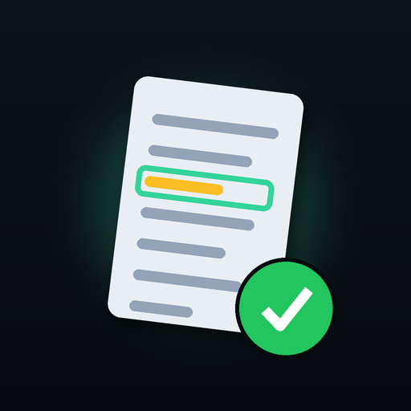
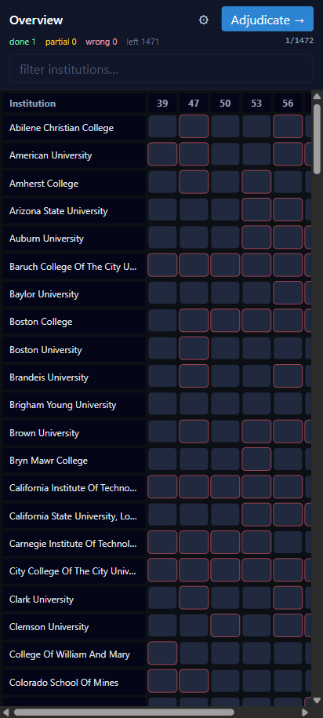
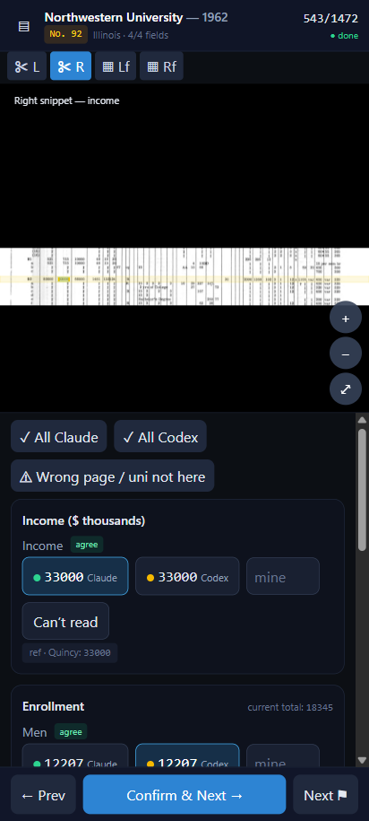
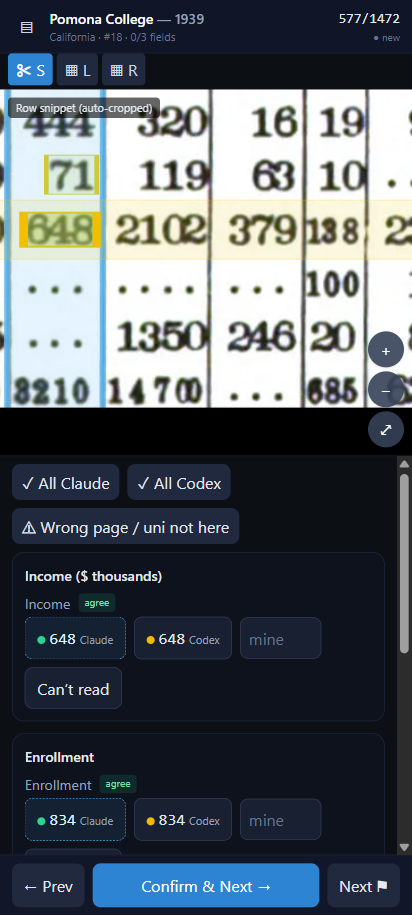

<div align="center">



# OCR Adjudicator

**A mobile-first, fully-offline app for verifying OCR / model extractions against the source scans.**

One tap to accept, conflicts surfaced first, the scan shown big with the value boxed — and your work
exported as clean data.

🔗 **Live app:** https://p-aldighieri.github.io/ocr-adjudicator/ · MIT licensed · no backend, no tracking





</div>

---

## What it does

You have model/OCR guesses for some values and the page images they came from. You want a human to
confirm the truth — fast, on a phone, offline — and get the result back as data. This app:

- **Shows the source scan big** with smooth pinch-zoom/pan, and an **overlay** that boxes the value
  each model read, highlights the institution's **row**, and (on ruled tables) its **column** — so the
  exact cell is unambiguous.
- Offers a **multiple choice per value** — model A / model B / **type your own** — plus **"Can't read"**
  and a card-level **"Wrong page / not here."**
- **Pre-selects the value when the extractors agree**, so confident cells are a single tap.
- Orders the queue **by group** (e.g. all years of one institution) or by **priority** (conflicts &
  low-confidence first), with a "jump to next unresolved."
- **Saves every choice instantly on-device** (survives reload / airplane mode) and **exports** to JSON/CSV.

It's **general-purpose**: feed it a *dataset bundle* (`dataset.json` + images) and it adjudicates any
extraction task. The reference dataset is the **College Blue Books** — 184 US universities × 8 years
(1939–1965), income / enrollment / faculty, with independent **Claude** and **Codex** extractions.

## Install on your phone (Android / Pixel)

One-time setup, ~3 minutes. After this it runs **fully offline**.

> Needs the phone and the host PC on the **same Wi-Fi** *only* for the one-time data download (Step 2).

**1. Install the app**
1. On the phone, open **Chrome** → **https://p-aldighieri.github.io/ocr-adjudicator/**
2. Chrome menu **⋮** → **Install app** (or **Add to Home screen**) → **Install**.
3. An **OCR Adjudicator** icon appears in your app drawer and opens full-screen like a native app.
   It will say *"No dataset loaded yet"* — expected.

**2. Load the data (one time)**
1. Serve the dataset bundle from the PC (from the repo folder):
   ```bash
   python -m http.server 8000 -d public
   ```
2. On the phone, open `http://<PC-LAN-IP>:8000/dataset.zip` in Chrome → it downloads `dataset.zip`
   (~300 MB) to **Downloads**. (Find the PC's IPv4 with `ipconfig`.)
3. In the app: **⚙ Settings → Import dataset .zip** → pick it from **Downloads**. Wait for *"Importing…"*.

The scans now live on the phone. Turn Wi-Fi off and keep working.
*(Alternatively, copy `public/dataset.zip` to the phone via USB or Drive and import it the same way.)*

> Prefer a literal `.apk`? The same web build can be wrapped with Capacitor — but the PWA gives the
> identical tap-the-icon, offline experience with far less friction.

## Using it

- Tap **Adjudicate →**, or any cell in the **Overview** grid, to open a record.
- Pinch-zoom the scan. The **yellow row** + **cyan column** highlight where each value sits; the amber
  **No. _n_** chip is the printed institution number, to help you find the row by eye.
- For each value: tap a model's value, **type your own**, or **Can't read** / **Wrong page**.
- Agreed values are pre-selected → tap **Confirm & Next →**. Everything saves instantly.

## Exporting your work

Your adjudications live on the device; export them whenever you want to pull them back to a computer.

1. In the app: **⚙ Settings → Export JSON** (full, re-importable) or **Export CSV** (one row per value).
2. Move the downloaded file to your computer (Drive, email, USB, or `adb pull`).
3. Merge it back into the source tables:
   ```bash
   python tools/apply_results.py adjudications.json \
          --dataset public/dataset/dataset.json \
          --panels "<path to covariate_panels>"      # optional: also writes reconciliation.csv
   ```
   This writes `adjudications_long.csv` (one row per value: institution, year, field, chosen value,
   provenance, status) and `adjudications_wide.csv` (one row per institution-year), plus
   `reconciliation.csv` flagging where your verified value differs from the prior best value.

The export is plain JSON/CSV — nothing is locked into the app.

## Build the Blue Book dataset

Requires Python 3 with `pillow`, `opencv-python`, and `rapidocr-onnxruntime`.

```bash
python tools/prewarm_ocr.py --of 10 --threads 2   # parallel OCR + WebP encode (~2–3 h, one-time, cached)
python tools/build_dataset.py                     # assemble dataset.json + images (~3 min)
python tools/add_column_bands.py                  # column-band overlays for dense ruled years (1939/47/50)
python tools/add_fullpage_overlays.py             # map row/value/column overlays onto the wide pages
python tools/add_cell_boxes.py                    # per-value grid-cell boxes for the dense years; re-zips
```

Notes:
- All steps are **incremental** — encoded images and the OCR cache (`tools/.ocr_cache.json`) are reused.
- `prewarm_ocr.py` deliberately uses **staggered subprocesses**; `multiprocessing.Pool` + onnxruntime
  deadlocks on Windows.
- **Overlays:** snippet years get per-value boxes + a row band; dense no-snippet years (1939/47/50) get
  a readable auto-cropped row strip with the row highlighted, plus **column bands** (1939 anchored from
  OCR; 1947/50 column positions read from the page headers by a vision model and verified against data).

## Use it for your own OCR task

The app is dataset-agnostic. Emit a `dataset.json` of this shape (images referenced by `file` sit next
to it; `overlays` coordinates are normalized 0–1 to each image's `w`/`h`, so they zoom locked to the scan):

```jsonc
{
  "meta": { "name": "...", "schema": 1, "years": [], "sources": ["claude","codex","current"] },
  "items": [{
    "id": "uniqueid", "group": "northwestern university", "groupKey": "stable-key",
    "title": "Northwestern University", "subtitle": "Illinois",
    "year": 1962, "n": 92, "priority": 0.0,
    "images": [{ "id":"", "file":"images/x.webp", "w":0, "h":0, "role":"snippet|full", "side":"", "label":"" }],
    "sections": [{
      "key": "income", "label": "Income ($ thousands)", "total": null,
      "fields": [{ "key":"income", "label":"Income", "imageId":"<image this value sits on>",
                   "candidates":[{"source":"claude","value":33000},{"source":"codex","value":33000}],
                   "agree": true, "default": "claude", "flags": [], "confident": true }]
    }],
    "overlays": { "<imageId>": { "row": {"y":0.49,"h":0.10},
                                  "boxes": [{ "field":"income","source":"claude","x":0,"y":0,"w":0,"h":0 }],
                                  "cols":  [{ "field":"income","x":0,"w":0 }] } }
  }]
}
```

Zip `dataset.json` + `images/` and import it via **Settings → Import dataset .zip**.

## Development

```bash
npm install
python tools/build_dataset.py --years 1962 1939 --limit 8   # small sample into public/dataset
npm run dev        # http://localhost:5173  (use a narrow / phone-sized window)
npm run build      # production build into dist/  (deployed to GitHub Pages via Actions)
```

Stack: Vite · React + TypeScript · Tailwind · `vite-plugin-pwa` (offline service worker) · Dexie
(IndexedDB) · `react-zoom-pan-pinch`. Routing is hash-based and the base path is relative, so it runs
from any subpath (e.g. GitHub Pages) with no server config.

## Project structure

```
src/
  store.tsx          dataset + results state (IndexedDB), settings
  dataset.ts         load bundle (bundled or imported .zip → OPFS), resolve image URLs
  queue.ts           queue ordering, status, progress
  exporter.ts        results JSON / CSV
  components/        ImageViewer (zoom + SVG overlays), FieldRow
  screens/          Overview, Adjudicate, Settings
tools/
  build_dataset.py    manifests + scans → dataset.json + WebP
  prewarm_ocr.py      parallel OCR + encode (fills the cache)
  add_column_bands.py column-band overlays for ruled tables
  add_fullpage_overlays.py  maps overlays onto the wide pages (template match)
  add_cell_boxes.py   per-value grid-cell boxes for the dense ruled years
  apply_results.py   merge exported adjudications back into the source tables
```

## License

MIT — see [LICENSE](LICENSE).
